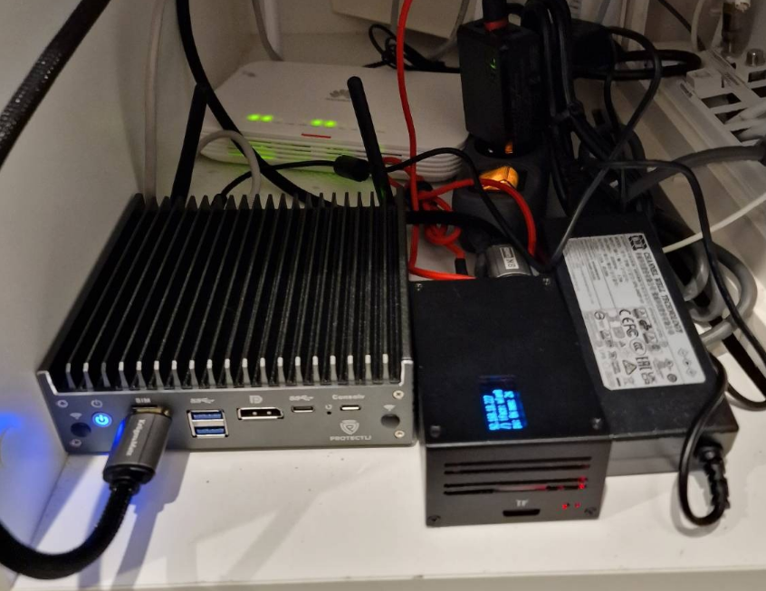
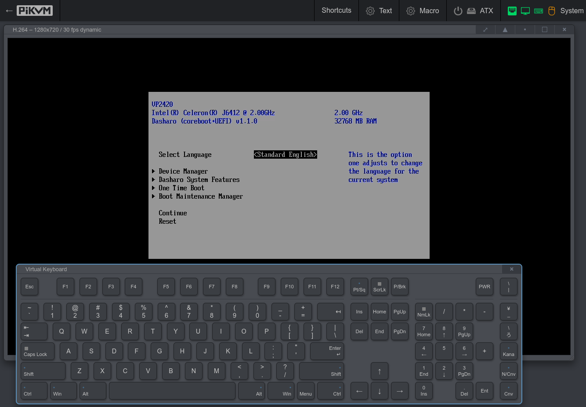

PiKVM is KVM over IP solution build on Raspberry PI. It helps me to remotely manage my Vault Protectli VP2420 server. 

You can find more details about the project at its official webpage [PiKVM](https://pikvm.org/)

## Raspberry Pi 4

The solution is build on Raspberry Pi 4 model B with 8GB of memory. I think there is nothing more to add here as the Raspberry Pi is well known and if you want to learn more, you can search in google.

## Geekworm KVM-A3

This Kit allows to build the PiKVM with Raspberry Pi 4. The KVM-A3 is composed of following parts:

- KVM-A3 Metal Case for Raspberry Pi 4
- X630 HDMI to CSI-2 Module (for video capture)
- X630-A3 Expansion Board (for ethernet, cooling, RTC, power in etc)
- X630-A5 Adapter Board (it is installed inside the PC case, and it connect the computer motherboard and IO panel cabe of PC case)
- 0.96 inch OLED (for display, Resolution: 128×64 pixel)
- Ethernet Cable (TIA/EIA-568.B connection, and it's ATX control signal cable)

For more details refer to [https://wiki.geekworm.com/PiKVM-A3](https://wiki.geekworm.com/PiKVM-A3)

## How it works

In an nutshell - the PiKVM must be connected to server via the HDMI cable to transfer the video and USB-C OTG cable to computer to emulate both keyboard + mouse. Of course the RPi must be connected to the network. Once you know the IP, you simply visit the web interface and you can start remotely control your server (reboot, enter bios etc.).

