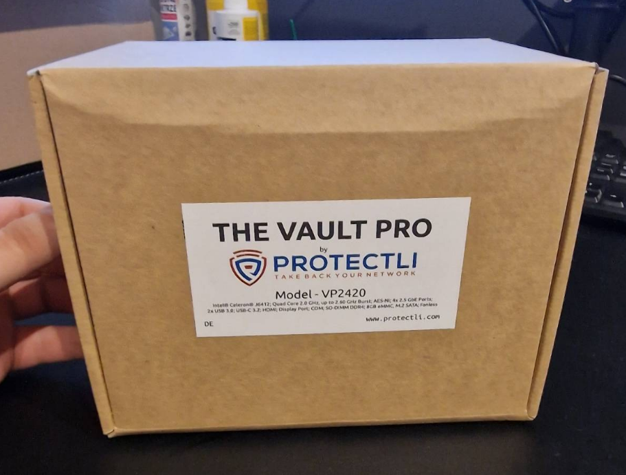
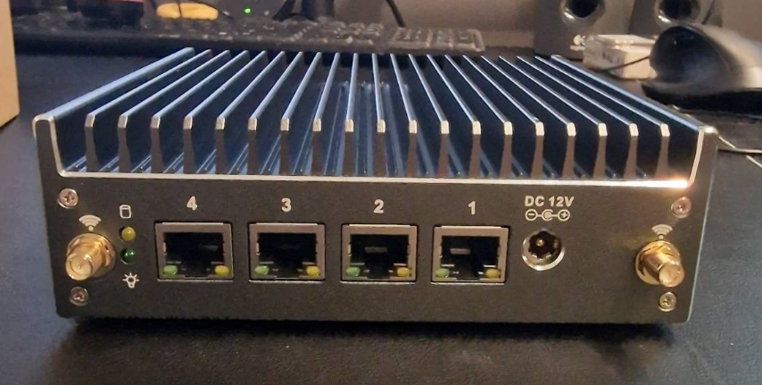
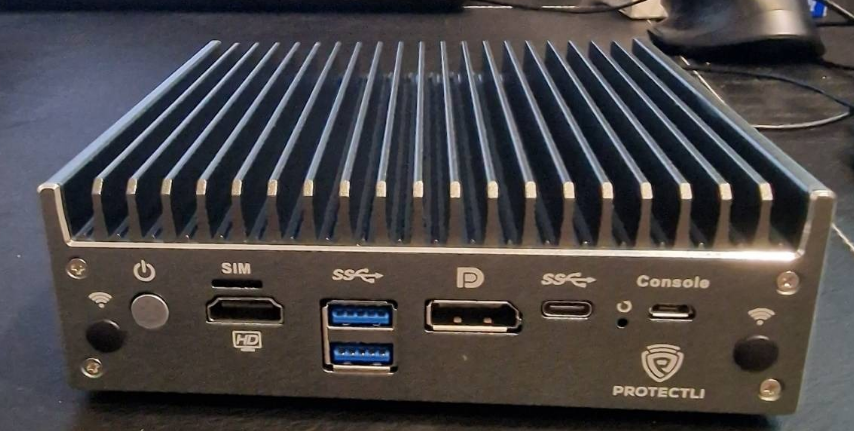
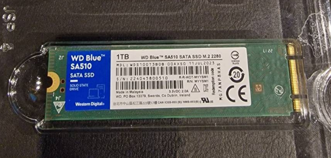
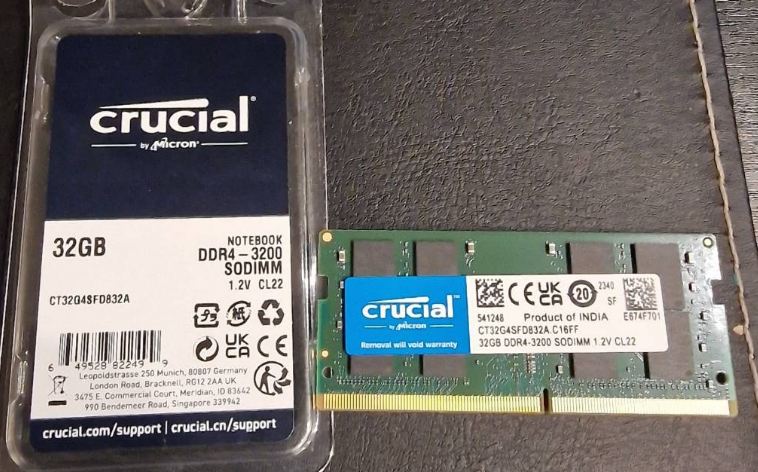
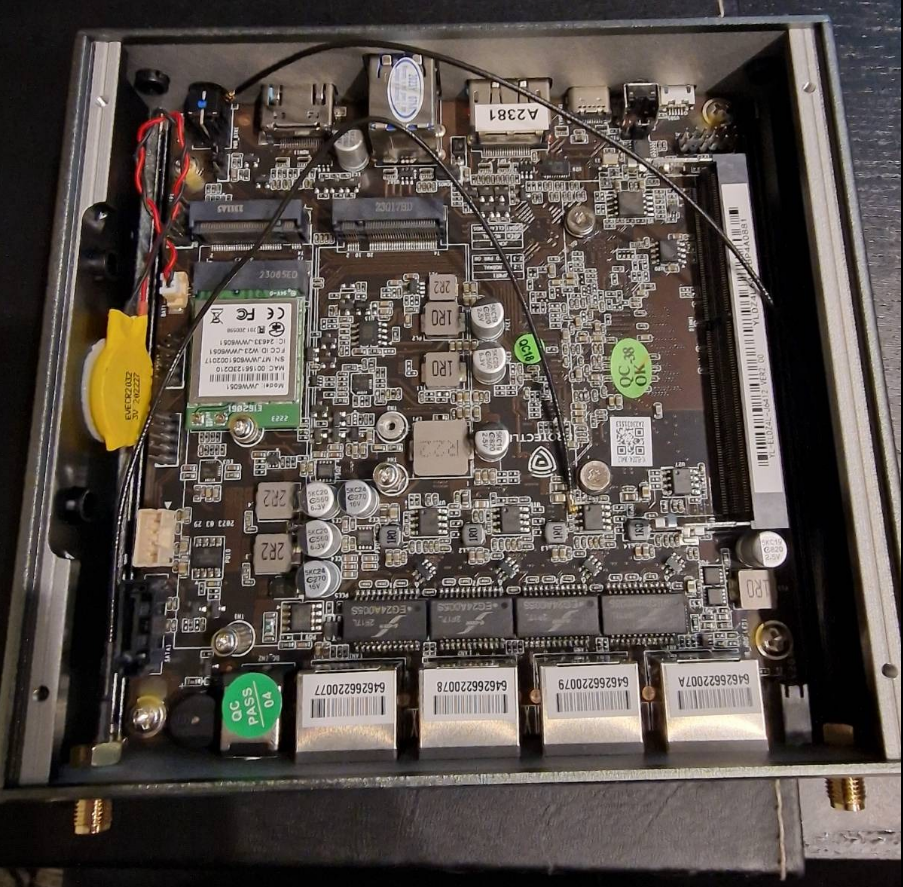
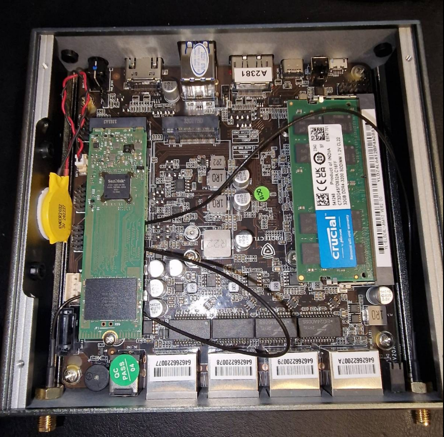
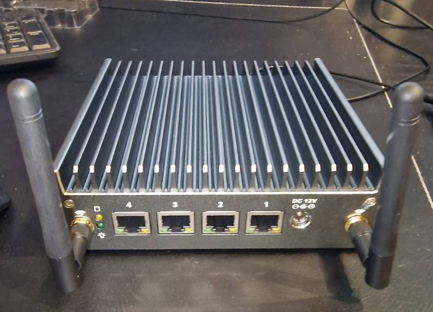
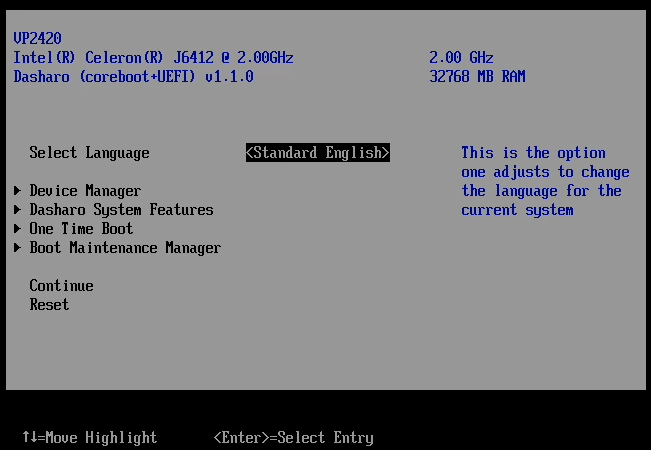

## The beginning

It's been a long time since I started to look for a computer which will help me build my home lab. It wasn't easy task, mainly due to my high expectations. I wanted to have something which will help me to host my media applications, storage server, smart home solutions and many many more. I thought that Raspberry PI will be ideal solution. However it turns out that I need to modernize also my network by buying extra routers, AP etc. Also, I would need some dedicated solution for the storage (there I thought that some NAS device will be a good choice). Another option was to buy few used micro / tiny PCs (which are available with decent price) and use them to built Kubernetes cluster. The number of ideas were growing and my mind was blown with number of possible options.

## Protectli Vault

One day I found a really nice video from Techno Tim [My Mobile HomeLab!](https://www.youtube.com/watch?v=02gYwJ2G-vE). He presented there his new Mobile HomeLab based on **Protectli Vault**. It was the very first time I've seen this company and their products. After reading a few more articles and their official webpage [Knowledge Base](https://kb.protectli.com/?intsrc=eu), I've decided to give it a try. It took me a while to select the proper product from the list. But Finally I decided on **Protectli Vault VP2420**.

## VP2420

The device comes with:

- 4x 2.5G Port
- Intel Celeron J6412 Quad Core at 2GHz
- M.2 SATA SSD Slot
- 16 GB eMMC module on board

More details at official product page [VP2420](https://eu.protectli.com/product/vp2420/) 

You can decide on buying the device together with extra components (like Memory, Storage M2 or SATA, TPM, WiFi, 4G/5G Modem). You can also select the BIOS (between AMI & coreboot), Power Cable, or Labels. I've decided to buy just a core device, together with WiFi Module to make sure I've used the supported device. I've selected also **coreboot** BIOS and EU Power Cable. The rest necessary components I've bought on my local market.

I placed an order a week before Christmas and fortunately got it in my home in about 4 working days (shipped from Germany). 

It came to me with the box labeled with PROTECTLI Brand and model details as seen on below picture:

In the front after unboxing we can see 4x NIC Ports together with WiFi antennas mount points and power plug socket.

In the back we have a number of ports for different interfaces, like:

- HDMI
- DisplayPort
- USB (A & C)
- SIM Card slot
- Serial Port

And of course power button.

## Assembly 

As I mentioned before, I've ordered a core device without memory and storage. Thus I bought them extra from my local suppliers. You can find the list of supported devices on the official Protectli webpage [Vault Hardware Compatibility](https://kb.protectli.com/kb/vault-hardware-compatibility/?intsrc=eu).

I decided to buy:

- Western Digital Blue SA510 (1TB SSD Drive) [Amazon](https://www.amazon.com/Western-Digital-SA510-Internal-Solid/dp/B09ZYNHPW2)

- Crucial 32GB DDR4 SODIMM (CT32G4SFD832A) [Amazon](https://www.amazon.com/Crucial-3200MHz-2933MHz-2666MHz-CT32G4SFD832A/dp/B07ZLC7VNH)

So it is time to assmembly everything together. First I had to open the bottom cover. This is how it looked originally. The WiFi Kit was partially assembled (cables were not connected to WiFi card).

Adding Memory and M2.SSD disk were easy, however the WiFi antennas cables got constantly unplugged. I was a bit tricky to connect them properly and mount M2.SSD on top of WiFi card. But finally I made it :).

Here is the final result:

And with assembled antennas:

## First Start

To start the Vault all we need is monitor with HDMI or DisplayPort cable + keyboard. By default the Vault will try to boot using network (PXE). We can click either **DEL** to enter the BIOS or **F11** to enter the **Boot Manager Menu**. From the list we can choose between:

- Network Boot and Utilities
- UEFI Shell
- eMMC Device

The coreboot BIOS is quite easy to use. 

The Vault is very quite cause it is fanless device. It was one of the main factor for when choosing the correct computer for my Homelab.

In the next sections I will be writing more about the **Protectli Vault VP2420**, focusing more on software installation and configuration. 