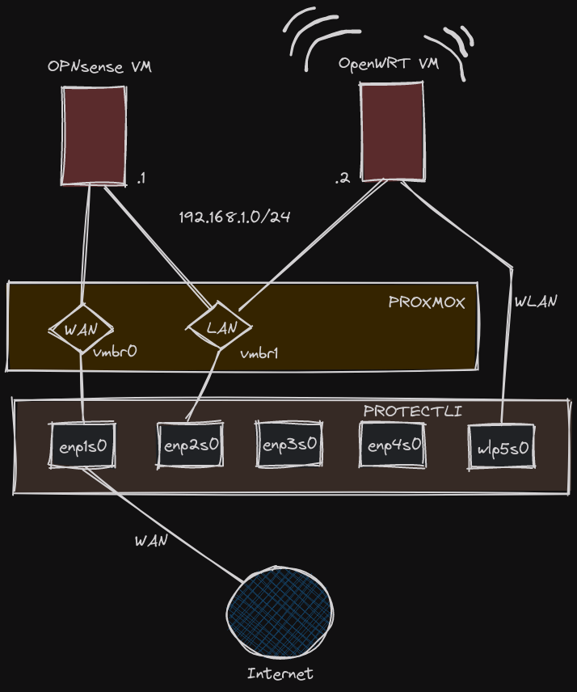
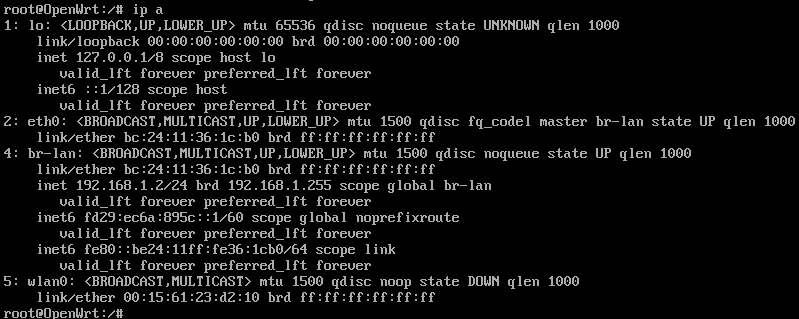
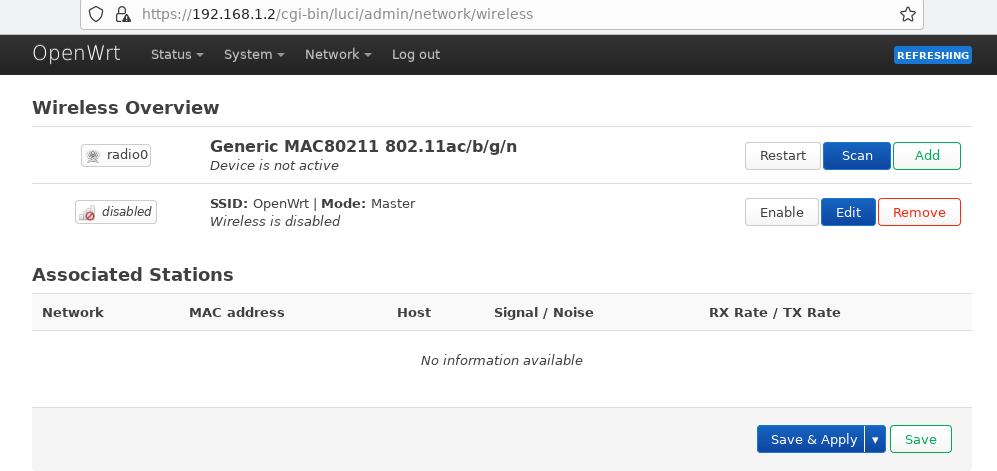
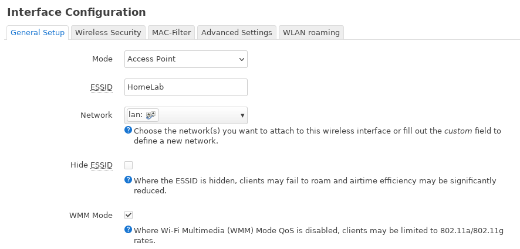
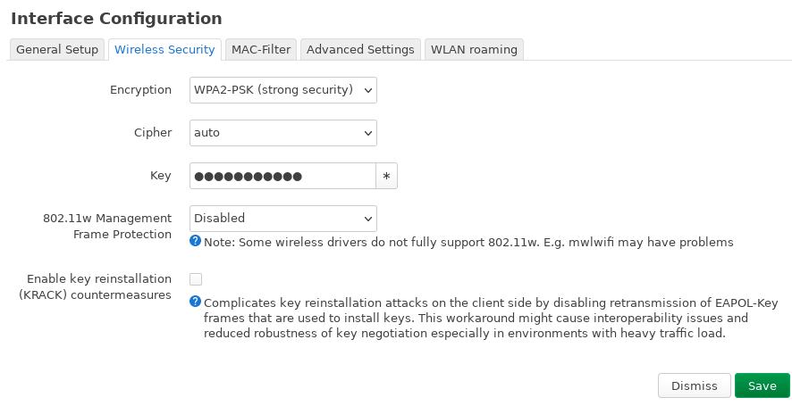
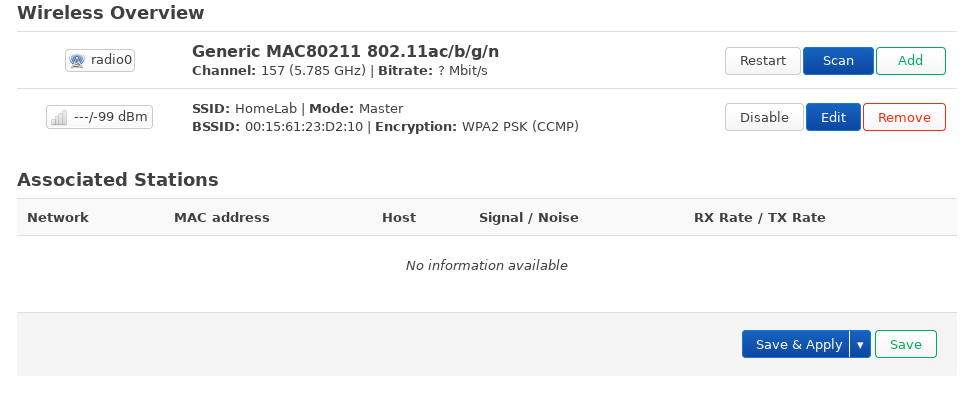

## WiFi Access Point

I bought my Protectli VP2420 device with extra WiFi Kit [Protectli M.2 802.11ac WiFi Kit](https://eu.protectli.com/product/m2-wifi/). I wanted to have all-in-one solution with WiFi included. Because, the BSD like systems does not support a lot of WiFi Chipsets (due to lack of drivers), configuring WiFi module based on **Qualcomm Atheros QCA6174A-5** was not an option on OPNsense. I was disappointed about it. But there are alternative solutions, like **OpenWrt** which supports it. However, installing and configuring it is not a piece of cake. More on it in further reading. 

## OpenWrt

The OpenWrt is well known, open source embedded operating system based on Linux. It's common alternative system for WiFi home Routers & Access Points which supports it. It comes with a number of options to configure your WiFi environment. It can be configured with both CLI or UI (Luci). Protectli created a nice tutorial about configuring and installing OpenWRT on the Vault. 

[How to Configure Protectli Wifi Kit in OpenWrt on the Vault](https://kb.protectli.com/kb/how-to-configure-protectli-wifi-kit-wap01k-in-openwrt-on-the-vault/)

### VM Configuration

I want to configure OpenWrt as Virtual Machine on Proxmox (LXC containers does not support physical devices passthrough). I found a nice article about the procedure [https://i12bretro.github.io/tutorials/0405.html](https://i12bretro.github.io/tutorials/0405.html), but decided to improve it by using Tofu for VM creating and configuration.

The VM will have single vNIC bridged to LAN subnet (vmbr1) and physical WLAN interface mapped from Protectli device. See below diagram for more info:



Here is my VM resource configured with the help of Tofu

```bash
resource "proxmox_virtual_environment_vm" "openwrt" {
  name        = "openwrt"
  description = "OpenWRT WiFi AP"
  tags        = ["network"]

  node_name = var.node
  vm_id     = 101

  cpu {
    type = "host"
  }

  hostpci {
    device = "hostpci0"
    id = "0000:05:00.0"
    rombar = true
  }

  memory {
    dedicated = 256
  }

  network_device {
    bridge = "vmbr1"
  }

  operating_system {
    type = "l26"
  }

  tablet_device = false
  on_boot = false

  boot_order = ["scsi0","net0","hostpci0"]
}
```

The VM has been created without any hard drive for the purpose. I had to prepare and import disk with latest OpenWrt image as described in previously mentioned article. The below command needs to be run from the Proxmox host shell:

```bash
latestVersion=23.05.2
wget -O openwrt.img.gz https://downloads.openwrt.org/releases/$latestVersion/targets/x86/64/openwrt-$latestVersion-x86-64-generic-ext4-combined.img.gz
gunzip ./openwrt.img.gz
mv ./openwrt*.img ./openwrt.raw
qemu-img resize -f raw ./openwrt.raw 512M
qm importdisk 102 openwrt.raw ssd-m2
```
Once the disk is imported and attached to OpenWrt VM, it needs to be attached into it. Just double click on the disk from the Hardware tab and confirm with OK. Now we can start the VM and wait a while for the system for the first boot.

### System Configuration

The very first step is to set new root password by running the command:

```bash
passwd
```

This password will be used later to access the Luci UI.

Next, configure the Interface IP Address, Default Gateway and DNS to allow access to the Internet. We are going to point to our OPNSense instance which plays a role of Firewall Gateway and temporary DNS:

```bash
uci set network.lan.ipaddr='192.168.1.2' 
uci set network.lan.gateway='192.168.1.1' 
uci set network.lan.dns='192.168.1.1' 
uci commit
service network restart
opkg update
```
Once the connection is working, we need to install additional packages with drivers and software for our WiFi Kit:

```bash
opkg install hostapd 
opkg install ath10k-firmware-qca6174  
opkg install kmod-ath10k
```
Finally, update the firmware to allow OS recognize the interface.

```bash
wget https://kb.protectli.com/wp-content/uploads/sites/9/2023/06/wifi-fix-standalone-0.3.1.tar.gz -O /tmp/wifi-fix-standalone-0.3.1.tar.gz 
cd /tmp 
tar zxf wifi-fix-standalone-0.3.1.tar.gz  
cp -rp /tmp/wifi-fix-standalone/vendor/* /lib/firmware/ath10k/QCA6174/hw3.0/ 
reboot
```

After the reboot, we can see that **wlan0** interface appeared on the list of interfaces.



### OpenWrt Configuration

In order to get access to OpenWRT, you need to have access to LAN network where OpenWrt VM is hosted. For me the best way was to create a tiny VM with minimal linux which has a browser and connect to Luci UI from there. In the next steps, I will show the minimum number of steps required to configure basic WiFi network with access to LAN behind OPNsense. For more advanced config, please refer to official project documentation.

1. Login to Web UI using address **https://192.168.1.2** and accept not trusted SSL Certificate.
2. Go to **Network** tab and select **Wireless**.
3. Here you should see your radio0 device and default WiFi "OpenWRT" network.

4. Edit the first available network and adjust at minimum **ESSID** value in General Setup tab + set the **Encryption** + key in Wireless Security tab.


5. Save and Click on **Enable** button next to the previously edited interface.


After that, you can see your new network being broadcasted. Just login and enjoy it!

## Summary

The configuration does not work out of the box. As you can see, the process requires a couple of non-trivial steps. With that being said, I must say I'm a bit disappointed. The signal is not a superpower. What is more, I would prefer to configure this WiFi on an OPNsense VM and not host another one and maintain it just for WiFi Management. I will think of maybe a dedicated WiFi device in the near future as an extension of my lab network.

